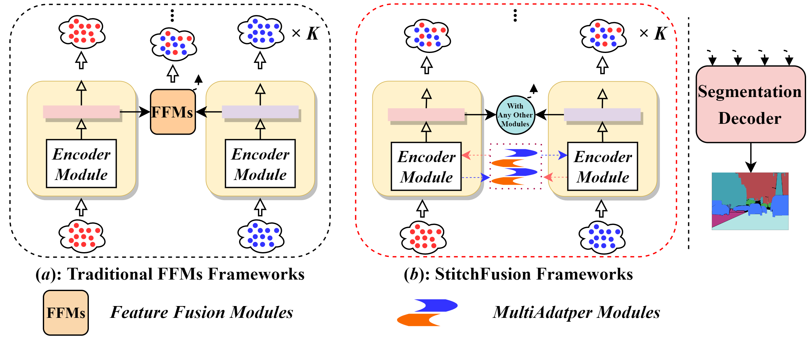
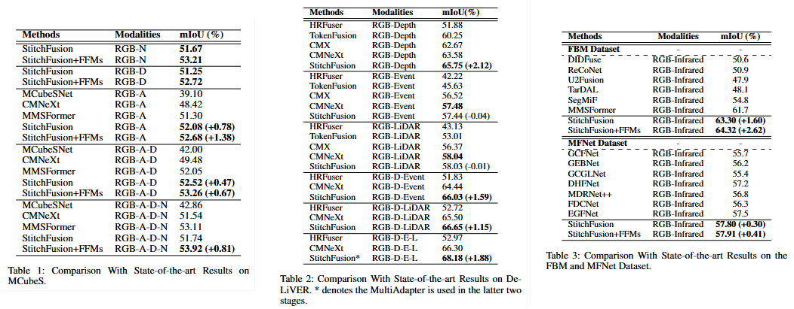
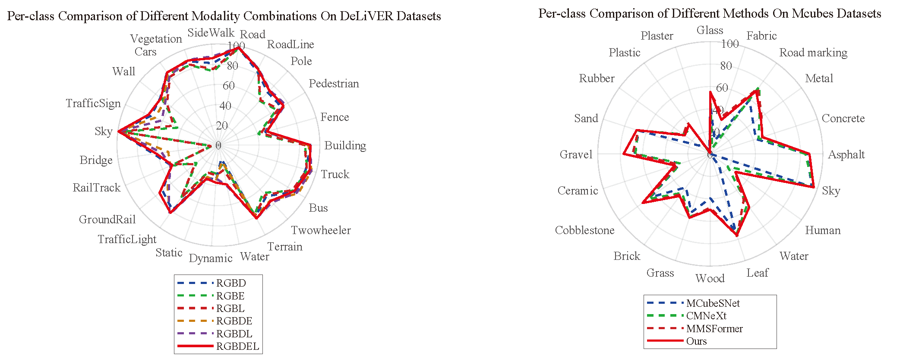
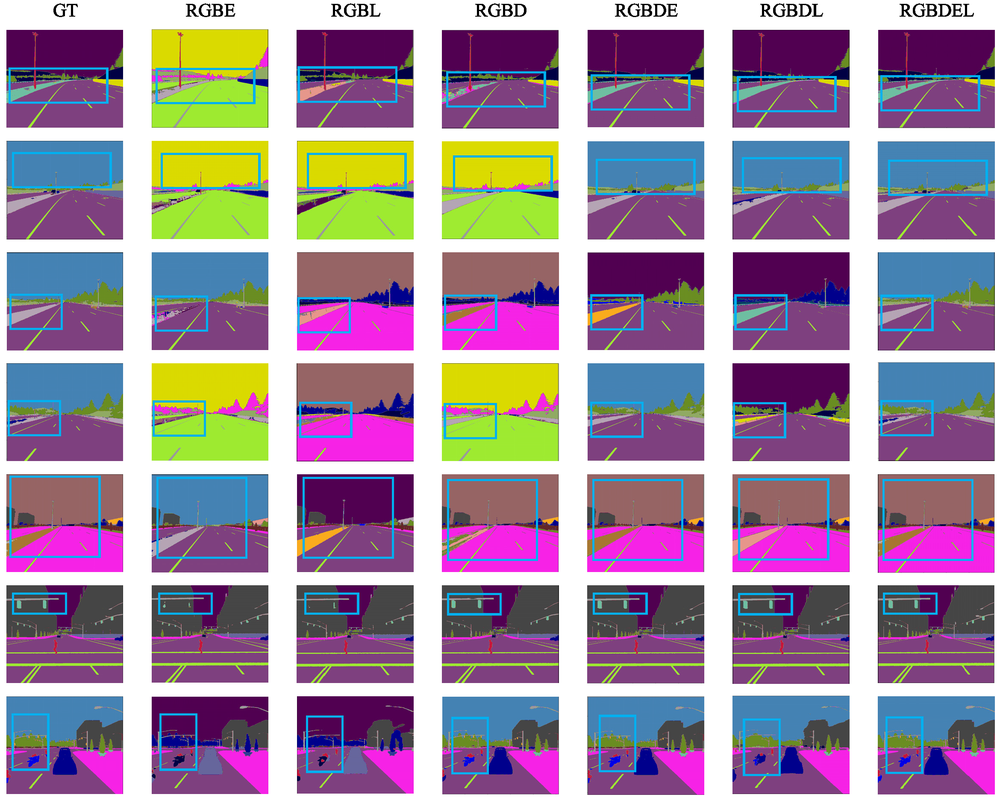
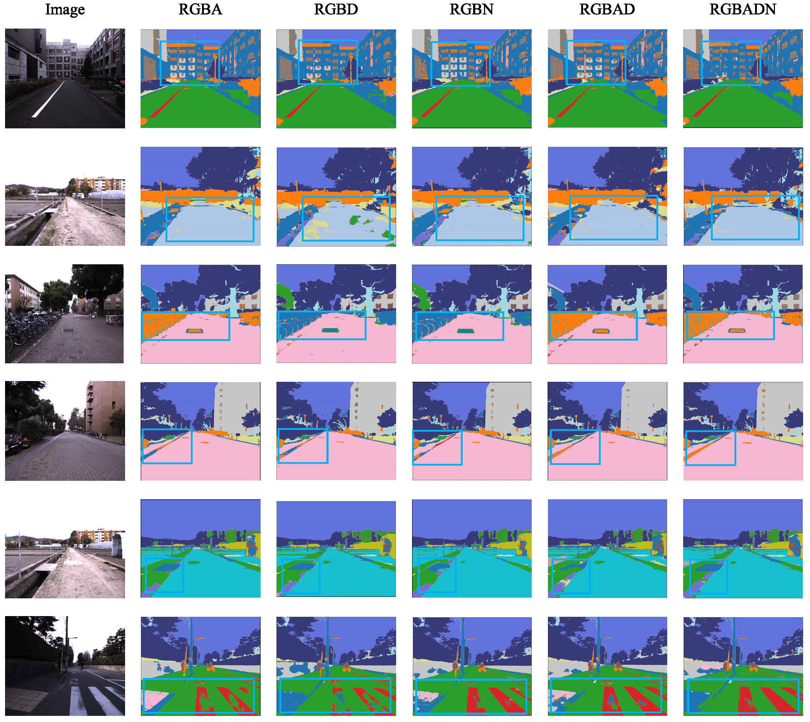

<div align="center"> 

## StitchFusion: Weaving Any Visual Modalities to Enhance Multimodal Semantic Segmentation
 Bingyu Li, Da Zhang, Zhiyuan Zhao, Junyu Gao, Xuelong Li
</div>
<p align="center">
<a href="http://arxiv.org/abs/2408.01343">
    </a>
<a href="https://pytorch.org/">
    </a>
<a href="LICENSE">
    </a>
</p>

This is the official implementation of our paper "[StitchFusion: Weaving Any Visual Modalities to Enhance Multimodal Semantic Segmentation](http://arxiv.org/abs/2408.01343)".


</div>

## 🎉 Our Paper Accepted as *Oral Presentation** at ACMMM 2025 🎉​
We are delighted to announce that our paper has been officially accepted by the ACM International Conference on Multimedia (ACMMM 2025) and selected for Oral Presentation!​
Highlights of Review Results​
Acceptance Type: Oral Presentation​
Average Review Score: 6.5/10​
Confidence Score: 4/5

## 💬 Introduction

Multimodal semantic segmentation shows significant potential for enhancing segmentation accuracy in complex scenes. However, current methods often incorporate specialized feature fusion modules tailored to specific modalities, thereby restricting input flexibility and increasing the number of training parameters. To address these challenges, we propose StitchFusion, a straightforward yet effective modal fusion framework that integrates large-scale pre-trained models directly as encoders and feature fusers. This approach facilitates comprehensive multi-modal and multi-scale feature fusion, accommodating any visual modal inputs.
Specifically, Our framework achieves modal integration during encoding by sharing multi-modal visual information. To enhance information exchange across modalities, we introduce a multi-directional adapter module (MultiAdapter) to enable cross-modal information transfer during encoding. By leveraging MultiAdapter to propagate multi-scale information across pre-trained encoders during the encoding process, StitchFusion achieves multi-modal visual information integration during encoding. Extensive comparative experiments demonstrate that our model achieves state-of-the-art performance on four multi-modal segmentation datasets with minimal additional parameters. Furthermore, the experimental integration of MultiAdapter with existing Feature Fusion Modules (FFMs) highlights their complementary nature.

## 🌟 News
- [x] 2024/9/20: A researcher has inquired about reproducible. pth files, and we are currently organizing them. However, as the permissions have not been granted to interns, we may need to wait for a period of time. If there is any news, we will make an update as soon as possible.If you have any questions, please contact the author's email: libingyu0205@mail.ustc.edu.cn
- [x] 2024/9/24: 更直接联系我的方式是libingyu0205@163.com，这将直接发到我的手机客户端。
- [x] If you find this repo is useful, please STAR it that make the authors encouraged.
- [x] stitchfusion_with_tips_you_can_copy.py
- [x] I have updated the reproducible files and made additional versions of StitchFusion available at **stitchfusion_with_tips_you_can_copy.py**. You can simply copy these files and run the experiments. To use any of these versions, just copy the path of the .pth file into the EVAL/MODEL_PATH field in your chosen config.yaml file.
- [x] I have release the reproducible files for DELIVER dataset, **However, during replication, I observed that the results differed slightly from the reported values, with variations of around a few tenths—some higher, some lower. Nevertheless, these differences do not affect the overall performance comparison of our model.**.
- [x] **stitchfusion_with_tips_you_can_copy.py** is all you need to reproduce the results.
- [x] **Recently, some researchers have reported that they are unable to reproduce the.pth files. Please refer to the issue (closed) to organize the code.**               
## 🚀 Updates
- [x] 2024/7/27: init repository.
- [x] 2024/7/27: release the code for StitchFusion.
- [x] 2024/8/02: upload the paper for StitchFusion.
- [x] 2024/11/6：upload some checkpoint file for StitchFuion.
- [x] 2024/11/12: release the reproducible files for DELIVER dataset.
      
## 🔍 StitchFusion model

<div align="center"> 


**Figure:** Comparison of different model fusion paradigms.


**Figure:** MultiAdapter Module For StitchFusion Framwork At Different Density Levels.

</div>

## 👁️ Environment

First, create and activate the environment using the following commands: 
```bash
conda env create -f environment.yaml
conda activate StitchFusion
```

## 📦 Data preparation
Download the dataset:
- [MCubeS](https://github.com/kyotovision-public/multimodal-material-segmentation), for multimodal material segmentation with RGB-A-D-N modalities.
- [FMB](https://github.com/JinyuanLiu-CV/SegMiF), for FMB dataset with RGB-Infrared modalities.
- [PST](https://github.com/ShreyasSkandanS/pst900_thermal_rgb), for PST900 dataset with RGB-Thermal modalities.
- [DeLiver](https://github.com/jamycheung/DELIVER), for DeLiVER dataset with RGB-D-E-L modalities.
- [MFNet](https://github.com/haqishen/MFNet-pytorch), for MFNet dataset with RGB-T modalities.
Then, put the dataset under `data` directory as follows:

```
data/
├── MCubeS
│   ├── polL_color
│   ├── polL_aolp_sin
│   ├── polL_aolp_cos
│   ├── polL_dolp
│   ├── NIR_warped
│   ├── NIR_warped_mask
│   ├── GT
│   ├── SSGT4MS
│   ├── list_folder
│   └── SS
├── FMB
│   ├── test
│   │   ├── color
│   │   ├── Infrared
│   │   ├── Label
│   │   └── Visible
│   ├── train
│   │   ├── color
│   │   ├── Infrared
│   │   ├── Label
│   │   └── Visible
├── PST
│   ├── test
│   │   ├── rgb
│   │   ├── thermal
│   │   └── labels
│   ├── train
│   │   ├── rgb
│   │   ├── thermal
│   │   └── labels
├── DELIVER
|   ├── depth
│       ├── cloud
│       │   ├── test
│       │   │   ├── MAP_10_point102
│       │   │   │   ├── 045050_depth_front.png
│       │   │   │   ├── ...
│       │   ├── train
│       │   └── val
│       ├── fog
│       ├── night
│       ├── rain
│       └── sun
│   ├── event
│   ├── hha
│   ├── img
│   ├── lidar
│   └── semantic
├── MFNet
|   ├── img
|   └── ther
```

## 📦 Model Zoo
### PST
All .pth will release later.
| Model-Modal      | mIoU   | weight |
| :--------------- | :----- | :----- |
| StitchFusion-RGB-T| 85.35 | [GoogleDrive](https://drive.google.com/drive/folders/1VnE_TxbjRnV5qxsKrypfVv1YbgoIVIaN?usp=sharing) |

### FMB
All .pth will release later.
| Model-Modal      | mIoU   | weight |
| :--------------- | :----- | :----- |
| StitchFusion-RGB-T| 64.85 | [GoogleDrive](https://drive.google.com/drive/folders/1B78Lgc6Aoln1g6KxKBHbKgFG2Sbdlyd3?usp=sharing) |

### MFNet
All .pth will release later.
| Model-Modal      | mIoU   | weight |
| :--------------- | :----- | :----- |
| StitchFusion-RGB-T| 57.91 | [GoogleDrive](https://drive.google.com/drive/folders/1JGhuCGQ9o50LDwfmnffbKGONnykoduBx?usp=sharing) |
| StitchFusion-RGB-T| 57.80 | [GoogleDrive](https://drive.google.com/drive/folders/1JGhuCGQ9o50LDwfmnffbKGONnykoduBx?usp=sharing) |
| StitchFusion-RGB-T| 58.13 | [GoogleDrive](https://drive.google.com/drive/folders/1JGhuCGQ9o50LDwfmnffbKGONnykoduBx?usp=sharing) |

### DELIVER
All .pth will release later.
| Model-Modal      | mIoU   | weight |
| :--------------- | :----- | :----- |
| StitchFusion-RGB-D| 65.75 | [GoogleDrive](https://drive.google.com/drive/folders/1jfEMb7ZNaJyTGwbzE3EUpY9cdrae1EMs?usp=sharing) |
| StitchFusion-RGB-E| 57.31 | [GoogleDrive](https://drive.google.com/drive/folders/1jfEMb7ZNaJyTGwbzE3EUpY9cdrae1EMs?usp=sharing) |
| StitchFusion-RGB-L| 58.03 | [GoogleDrive](https://drive.google.com/drive/folders/1jfEMb7ZNaJyTGwbzE3EUpY9cdrae1EMs?usp=sharing) |
| StitchFusion-RGB-DE| 66.03 | [GoogleDrive](https://drive.google.com/drive/folders/1jfEMb7ZNaJyTGwbzE3EUpY9cdrae1EMs?usp=sharing) |
| StitchFusion-RGB-DL| 67.06 | [GoogleDrive](https://drive.google.com/drive/folders/1jfEMb7ZNaJyTGwbzE3EUpY9cdrae1EMs?usp=sharing) |
| StitchFusion-RGB-DEL| 68.18 | [GoogleDrive](https://drive.google.com/drive/folders/1jfEMb7ZNaJyTGwbzE3EUpY9cdrae1EMs?usp=sharing) |


**Figure:** Main Results: Comparision With SOTA Model.


**Figure:** Main Results: Per-Class Comparision in Different Modality Combination Config and With SOTA Model.
### MCubeS

### FMB

### PST900

### DeLiVER

### MFNet

## 👁️ Training

Before training, please download [pre-trained SegFormer](https://drive.google.com/drive/folders/10XgSW8f7ghRs9fJ0dE-EV8G2E_guVsT5), and put it in the correct directory following this structure:

```text
checkpoints/pretrained/segformer
├── mit_b0.pth
├── mit_b1.pth
├── mit_b2.pth
├── mit_b3.pth
└── mit_b4.pth
```

To train StitchFusion model, please update the appropriate configuration file in `configs/` with appropriate paths and hyper-parameters. Then run as follows:

```bash
cd path/to/StitchFusion
conda activate StitchFusion

python -m tools.train_mm --cfg configs/mcubes_rgbadn.yaml

python -m tools.train_mm --cfg configs/fmb_rgbt.yaml

python -m tools.train_mm --cfg configs/pst_rgbt.yaml
```


## 👁️ Evaluation
To evaluate StitchFusion models, please download respective model weights (**GoogleDrive**) and save them under any folder you like.


Then, update the `EVAL` section of the appropriate configuration file in `configs/` and run:

```bash
cd path/to/StitchFusion
conda activate StitchFusion

python -m tools.val_mm --cfg configs/mcubes_rgbadn.yaml

python -m tools.val_mm --cfg configs/fmb_rgbt.yaml

python -m tools.val_mm --cfg configs/pst_rgbt.yaml

python -m tools.val_mm --cfg configs/deliver.yaml

python -m tools.val_mm --cfg configs/mfnet_rgbt.yaml
```

## 👁️ Evaluation

**Figure:** Visulization of StitchFusion On DeLiver Dataset.

**Figure:** Visulization of StitchFusion On Mcubes Dataset.
## 🚩 License
This repository is under the Apache-2.0 license. For commercial use, please contact with the authors.


## 📜 Citations
```
@article{li2024stitchfusion,
  title={StitchFusion: Weaving Any Visual Modalities to Enhance Multimodal Semantic Segmentation},
  author={Li, Bingyu and Zhang, Da and Zhao, Zhiyuan and Gao, Junyu and Li, Xuelong},
  journal={arXiv preprint arXiv:2408.01343},
  year={2024}
}
```
## 🔈 Acknowledgements
Our codebase is based on the following Github repositories. Thanks to the following public repositories:
- [DELIVER](https://github.com/jamycheung/DELIVER)
- [MMSFormer](https://github.com/csiplab/MMSFormer)
- [Semantic-segmentation](https://github.com/sithu31296/semantic-segmentation)

**Note:** This is a research level repository and might contain issues/bugs. Please contact the authors for any query.
